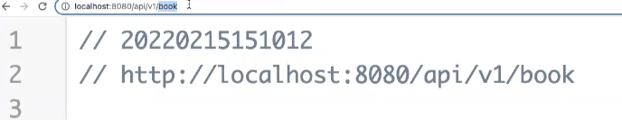
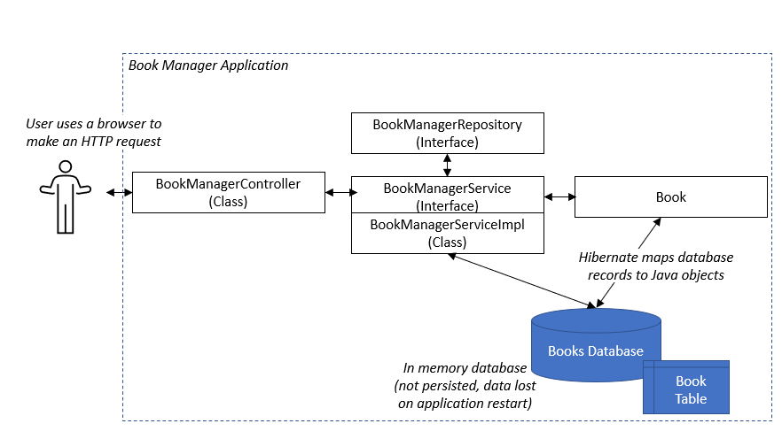

# 📖 Minimalist Book Manager API

# Solution

# Introduction

The API structure has a `src`, a `test` and `main` directories with the java files we need. 
This application is a Spring Boot application, that is part of the Spring Boot ecosystem. 
It is a framework we can use to quickly start to build a web application using Java.

To run this API you need to watch out for the `@SpringBootApplication` annotation which 
tells the Spring framework that this specific class is the main entry point. 
The annotation is in the `BookmanagerApplication` main class in the `bookmanager` 
package. Run the application.

In a browser, go to `localhost:8080/api/v1/book` and you can see the API:

# Solution Overview

The application is structured as shown below:

As a user I can use my browser to make an HTTP request to the application.
The `BookManagerController` listens for requests and passes them to the `BookManagerService`.
The `BookManagerService` is the  central component of the application. It has
a `Book` model representing data from the book database. Hibernate is used to map database records to 
Java objects. 
This service handles the following requests: 
- Create - `insertBook` 
- Read - `getBookById`. In order to get all books, we have `getAllBooks()` in the `BookManagerController` class. 
 The method `getAllBooks()` is implemented in `BookManagerServiceImpl` class.
- Update - `updateBookById`
- Delete - `deleteBookById`

